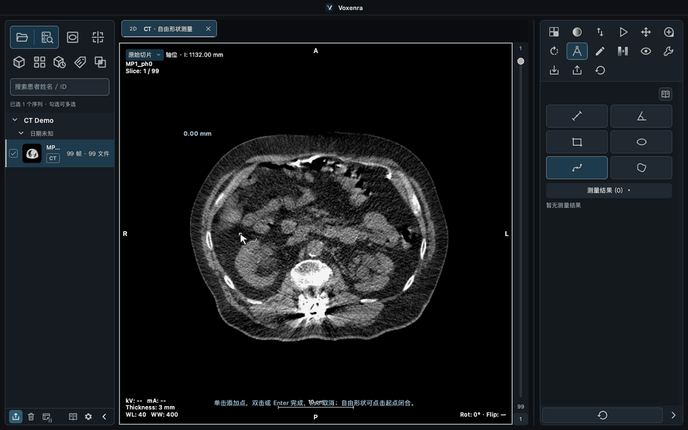
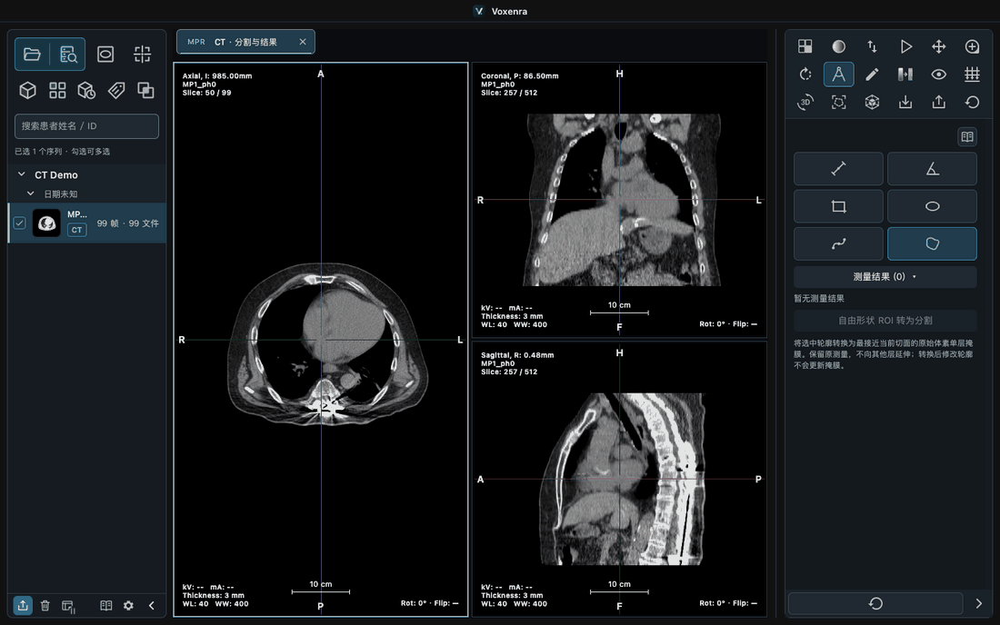

<p align="center">
  
</p>

# Voxenra

[简体中文](README.md) | [English](README.en.md)

[Product website](https://l5769389.github.io/voxenra/en-us/) · [Online manual](https://l5769389.github.io/voxenra/en/)

A cross-platform DICOM workspace for CT, MR, and PET viewing, reconstruction, fusion, measurement, segmentation, and export.

[macOS · Apple Silicon](https://github.com/l5769389/voxenra/releases/download/v1.6.0/Voxenra-1.6.0-macos-arm64.dmg) · [Windows · Installer](https://github.com/l5769389/voxenra/releases/download/v1.6.0/Voxenra-1.6.0-windows-x64-setup.exe) · [Windows · Portable](https://github.com/l5769389/voxenra/releases/download/v1.6.0/Voxenra-1.6.0-windows-x64-portable.exe) · [Releases](https://github.com/l5769389/voxenra/releases)

## Features

| Area | Capabilities |
| --- | --- |
| Image management | Import files, folders, and archives; query and download from PACS; inspect DICOM tags. |
| 2D viewing | Windowing, color maps, zoom, rotation, flipping, cine playback, montage, and linked multi-series comparison. |
| Reconstruction and 3D | Three-plane and oblique MPR, thick-slab projection, volume rendering, presets and cropping, and multi-phase CT 4D. |
| PET/CT fusion | Linked CT, PET, fused, and MIP views; manual rigid registration; blend controls; fused 3D. |
| Measurement and segmentation | Length, angle, curve, rectangle, ellipse, and free-shape ROIs; threshold segmentation, VOI, segment management, and statistics. |
| Analysis and reports | CT water phantom QA, point-source MTF, ramp FWHM and slice thickness; PNG, DICOM, CSV/PDF, SEG, and SR export. |
| Workspace | Tabs, detached windows, layouts, save and restore, light and dark themes, language packs, and an offline manual. |

## 2D viewing and comparison

Original slices and reconstructed planes are clearly separated. Adjust CT/MR windows and PET ranges, use color maps and cine playback, or compare linked and independent viewports.

<table>
<tr>
<td width="50%"><b>MR viewing</b><br><a href="docs/screenshots/07-mr-reading.png"></a></td>
<td width="50%"><b>Multi-series comparison</b><br><a href="docs/screenshots/08-enhanced-mr-compare.png"></a></td>
</tr>
<tr>
<td><b>Custom 2D layout</b><br><a href="docs/screenshots/10-2d-layout.png"></a></td>
<td><b>Montage and color maps</b><br><a href="docs/screenshots/12-mr-montage.png"></a></td>
</tr>
</table>

## MPR, 3D, and 4D

- **MPR:** linked axial, coronal, and sagittal planes; oblique reconstruction, dual-series comparison, and MIP / MinIP / Mean / Sum thick slabs.
- **3D:** CT, MR, and PET volume rendering with presets, windowing, rotation, and region cropping; 20 CT presets.
- **4D:** synchronized multi-phase CT playback, with segmentation and VOI stored by phase.

**MPR layouts:** switch between three-plane and 3D arrangements, maximize a viewport, and remember the layout.


<table>
<tr>
<td width="50%"><b>Oblique MPR</b><br><a href="docs/screenshots/14-oblique-mpr.png"></a></td>
<td width="50%"><b>Dual-series MPR</b><br><a href="docs/screenshots/09-mpr-compare.png"></a></td>
</tr>
</table>

**3D presets and rotation**


**4D playback**


## PET/CT fusion

View CT, PET, fused planes, and whole-volume MIP together. Adjust orientation, color maps, and blending; perform manual rigid registration. Fused 3D has separate CT and PET display controls.


<table>
<tr>
<td width="50%"><b>2D fusion</b><br><a href="docs/screenshots/05-pet-ct-fusion.png"></a></td>
<td width="50%"><b>3D fusion</b><br><a href="docs/screenshots/06-fusion-3d.png"></a></td>
</tr>
</table>

## Measurement, segmentation, and reporting

- **Measurements:** length, angle, curve, rectangle, ellipse, and free-shape ROIs, with area, perimeter, and intensity statistics; edit, copy and paste, undo and redo.
- **Segmentation:** MPR threshold segmentation, single-slice segment creation from free-shape ROIs, VOI analysis, and independently named, colored, and managed segments.
- **Results:** export measurements as CSV/PDF or DICOM SR; export DICOM SEG and import SEG associated with the current image.

**Free-shape measurement:** click to place control points and create a smooth closed contour.


**Curve measurement:** place a few controls to measure the physical arc length of a smooth path.



**Segmentation exchange**



<table>
<tr>
<td width="50%"><b>Associated results import</b><br><a href="docs/screenshots/33-associated-import.png"></a></td>
<td width="50%"><b>Structured measurement report</b><br><a href="docs/screenshots/32-structured-report.png"></a></td>
</tr>
<tr>
<td><b>CT water phantom QA</b><br><a href="docs/screenshots/19-water-qa.png"></a></td>
<td><b>Point-source MTF</b><br><a href="docs/screenshots/28-mtf-analysis.png"></a></td>
</tr>
</table>

## Data and workspaces

Import source images on the left and associated SEG results on the right. Mix files, folders, and archives, drag in images, query PACS, inspect DICOM tags, and export PNG or source DICOM.

Detach tabs into separate windows. Workspaces preserve image references, layouts, and editing state, with automatic recovery. Use light or dark themes, bundled Chinese, English, and Brazilian Portuguese, local JSON language packs, collapsible sidebars, and a searchable offline manual.

<table>
<tr>
<td width="50%"><b>Local import</b><br><a href="docs/screenshots/15-mixed-import.png"></a></td>
<td width="50%"><b>PACS browser</b><br><a href="docs/screenshots/16-pacs-browser.png"></a></td>
</tr>
<tr>
<td><b>Detached window</b><br><a href="docs/screenshots/13-detached-tabs.png"></a></td>
<td><b>Light theme</b><br><a href="docs/screenshots/26-theme-light.png"></a></td>
</tr>
</table>

[View the interface gallery](docs/screenshots/README.md)

## Supported formats and limits

- Supports conventional and Enhanced CT/MR/PET and RLE, JPEG, JPEG-LS, and JPEG 2000 pixel decoding. MPR/3D require regular spatial sampling; PET quantification depends on image metadata.
- NIfTI/NRRD, dynamic or gated PET, MR 4D, fMRI/DTI analysis, and SR/RTSTRUCT import are not currently supported.
- SEG/SR keep source identity and image references; PNG/plain DICOM anonymization options do not apply to them.

## Documentation and running from source

[Online manual](https://l5769389.github.io/voxenra/en/) · [Image support](docs/image-support.md) · [Local import](docs/local-import.md) · [PACS](docs/pacs.md) · [PET and fusion](docs/pet-mpr-fusion.md) · [Segmentation and VOI](docs/mpr-segmentation-voi.md) · [Export](docs/export.md) · [Offline manual notes](docs/manual.md) · [Development and packaging](docs/packaging.md)

```bash
uv run voxenra
```
