# 功能图集

Voxenra 的实际应用界面：当前界面截图与操作动画。[中文首页](../../README.md) · [English README](../../README.en.md)

## 操作动画

- [ZIP 压缩包拖拽导入](06-zip-drag.gif)
- [自由形状 ROI 绘制与统计](01-freehand-measurement.gif)
- [分割结果导出与导入](02-segmentation-exchange.gif)
- [4D 多时相播放](03-4d-playback.gif)
- [CT 3D 模板与旋转](04-volume-presets.gif)
- [PET/CT 切面与融合比例](05-pet-ct-fusion.gif)
- [MPR 布局切换](11-mpr-layouts.gif)
- [曲线测量](33-curve-measurement.gif)
- [新增本地语言包](../../src/qt_dicom_viewer/qml/assets/help/language-pack.gif)

## 阅片与布局

<table>
<tr>
<td width="50%"><b>MR 阅片</b> </td>
<td width="50%"><b>多序列 2D 对比</b> </td>
</tr>
<tr>
<td width="50%"><b>2D 多视口</b> </td>
<td width="50%"><b>序列平铺</b> </td>
</tr>
<tr>
<td width="50%"><b>双序列 MPR 对比</b> </td>
<td width="50%"><b>MPR 四宫格</b> </td>
</tr>
<tr>
<td width="50%"><b>斜面重建</b> </td>
<td width="50%"><b>厚层投影</b> </td>
</tr>
</table>

## 三维与融合

<table>
<tr>
<td width="50%"><b>3D 体绘制</b> </td>
<td width="50%"><b>3D 圈选裁剪</b> </td>
</tr>
<tr>
<td width="50%"><b>4D 多时相</b> </td>
<td width="50%"><b>PET/CT 融合</b> </td>
</tr>
<tr>
<td width="50%"><b>融合 3D</b> </td>
</tr>
</table>

## 测量、分割与分析

<table>
<tr>
<td width="50%"><b>测量与标注</b> <a href="01-2d-measurement.png">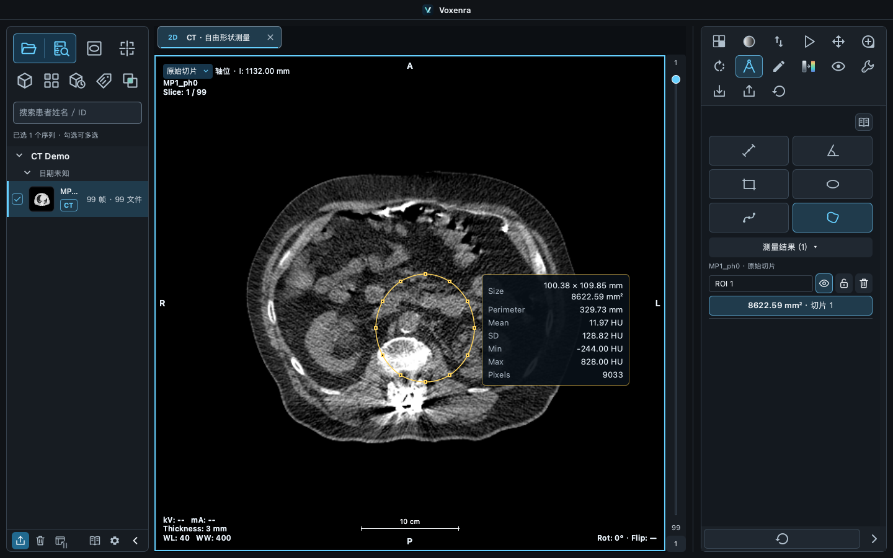</a></td>
<td width="50%"><b>MPR 阈值分割</b> <a href="02-mpr-segmentation.png">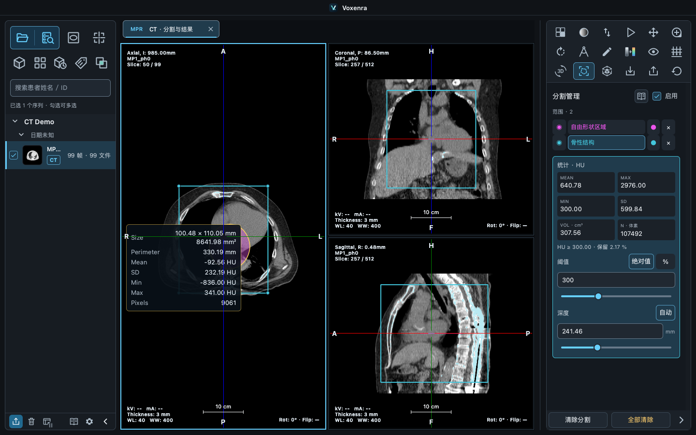</a></td>
</tr>
<tr>
<td width="50%"><b>VOI 分析</b> </td>
<td width="50%"><b>CT 水模 QA</b> </td>
</tr>
<tr>
<td width="50%"><b>点源 MTF</b> <a href="28-mtf-analysis.png">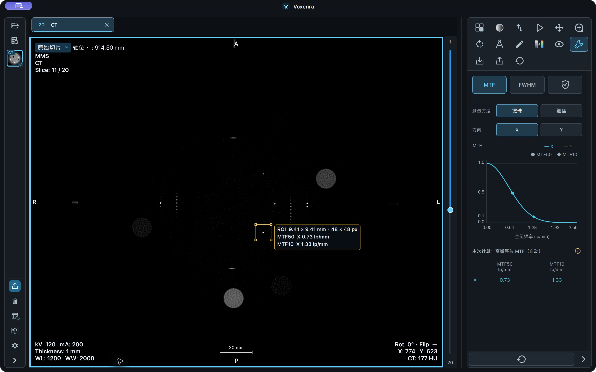</a></td>
<td width="50%"><b>自由形状 ROI 转分割</b> <a href="31-freehand-to-seg.png">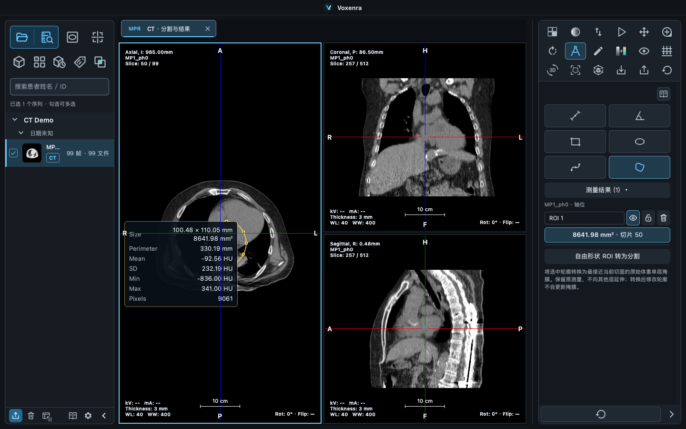</a></td>
</tr>
<tr>
<td width="50%"><b>SEG 与 SR 报告</b> <a href="32-structured-report.png">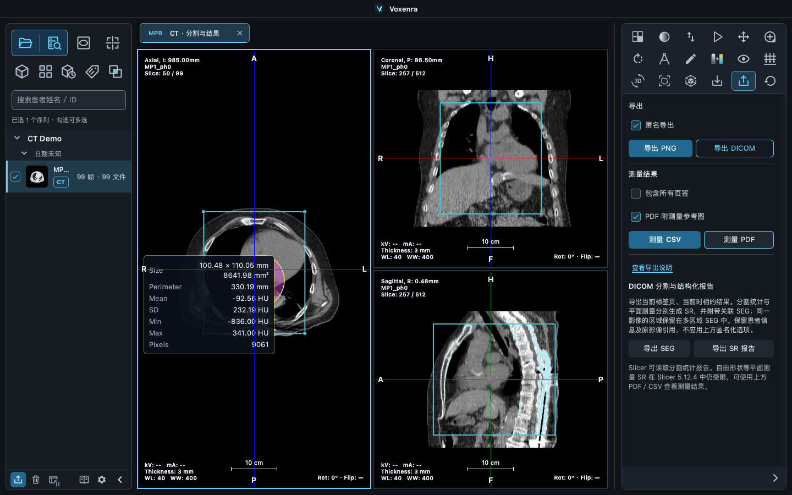</a></td>
<td width="50%"><b>关联 SEG 导入</b> <a href="33-associated-import.png">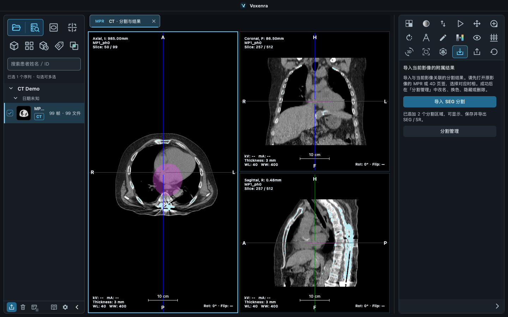</a></td>
</tr>
<tr>
<td width="50%"><b>多个分割区域管理</b> <a href="34-segment-management.png">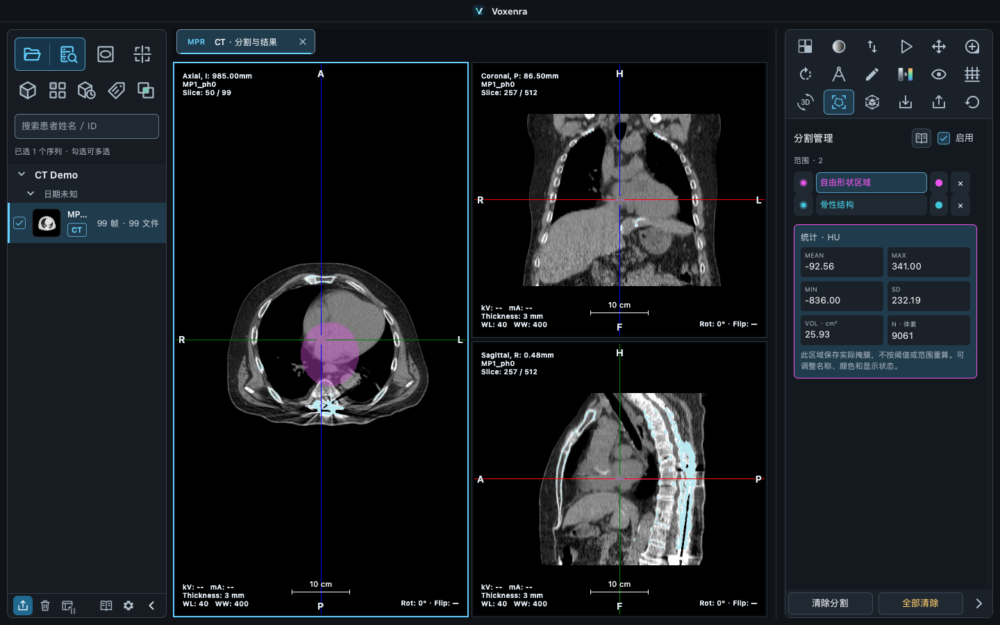</a></td>
</tr>
</table>

## 数据与工作区

<table>
<tr>
<td width="50%"><b>拖拽 ZIP 到内容区</b> <a href="35-zip-drop.png">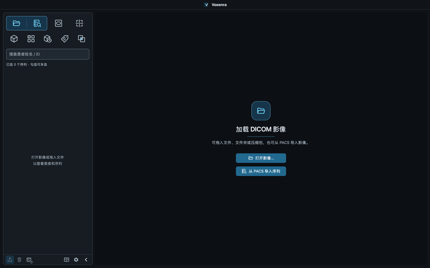</a></td>
<td width="50%"><b>PACS 浏览器</b> </td>
</tr>
<tr>
<td width="50%"><b>本地导入</b> <a href="15-mixed-import.png">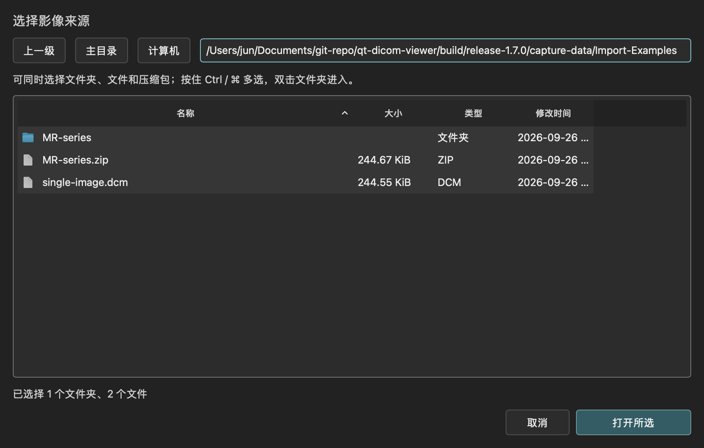</a></td>
<td width="50%"><b>工作区全景</b> <a href="36-workspace-full.png">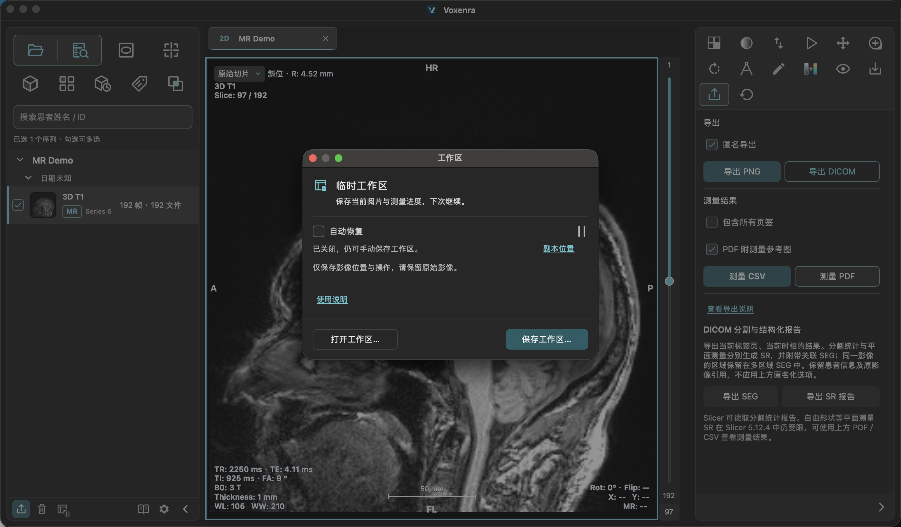</a></td>
</tr>
<tr>
<td width="50%"><b>PACS 导入</b> </td>
<td width="50%"><b>DICOM 标签</b> </td>
</tr>
<tr>
<td width="50%"><b>导出</b> <a href="18-export.png">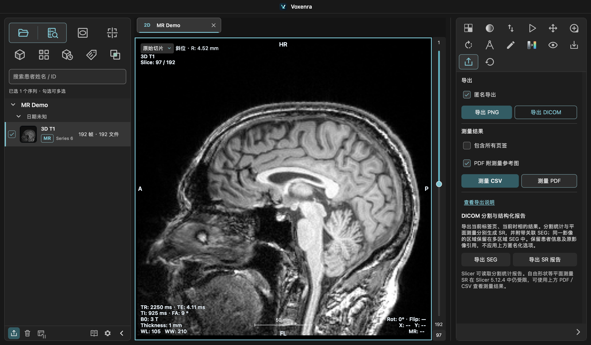</a></td>
<td width="50%"><b>工作区保存对话框</b> <a href="17-workspace.png">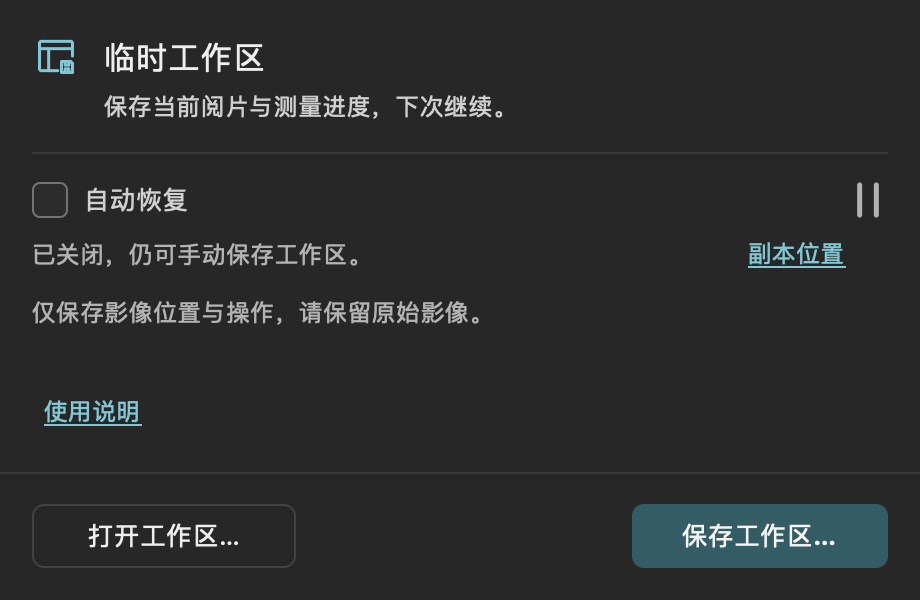</a></td>
</tr>
<tr>
<td width="50%"><b>独立窗口</b> </td>
<td width="50%"><b>紧凑侧栏</b> </td>
</tr>
<tr>
<td width="50%"><b>深色主题</b> </td>
<td width="50%"><b>浅色主题</b> </td>
</tr>
<tr>
<td width="50%"><b>显示设置</b> <a href="22-display-settings.png">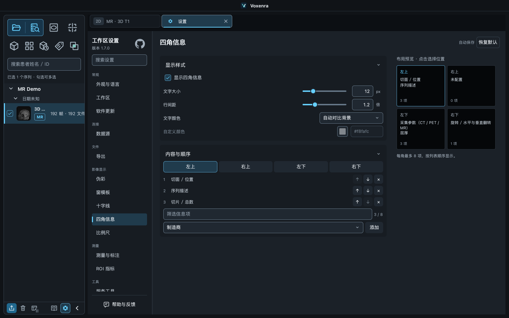</a></td>
<td width="50%"><b>离线手册</b> </td>
</tr>
</table>

## 外观与预设

- [中性深灰阅片](37-theme-graphite.png)
- [主题与语言设置](38-appearance-settings.png)
- [本地 JSON 窗模板](39-window-presets.png)
